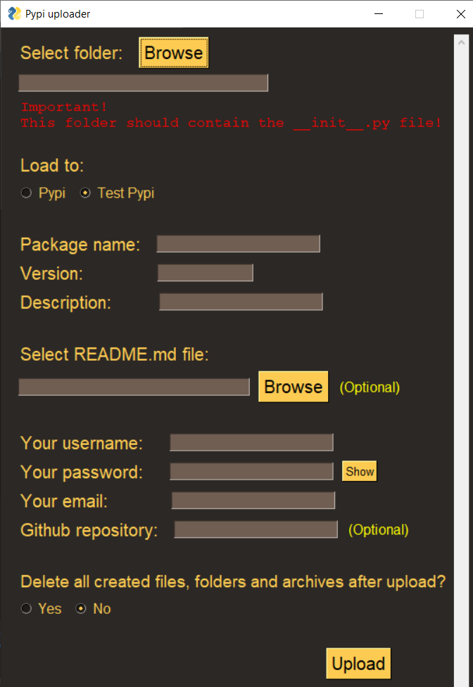

# Pypi-uploader
#### Upload your Python libraries to PyPi with a beautiful interface.

</br>

This program is written using the PySimpleGUI library.

Just run <a href="Pypi_uploader.py">Pypi_uploader.py</a> and follow the instructions on the screen.

The program will automatically install the necessary libraries and compile your project into an archive and upload it to Pypi or Test Pypi.

After uploading, you can also clean up all generated files.

#### Important! Selected project folder should contain the ```__init__.py``` file! This is the main file of your library.

</img>
