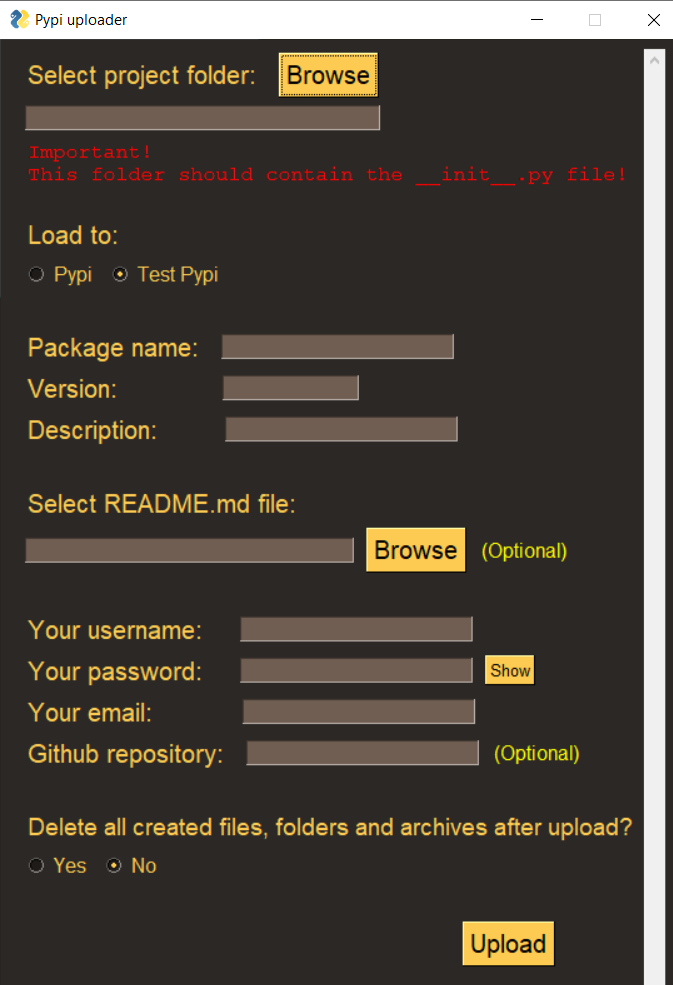

# Pypi-uploader
#### Загружайте свои библиотеки Python на PyPi с помощью красивого интерфейса.

</br>

Эта программа написана с помощью библиотеки <a href="https://pypi.org/project/PySimpleGUI/">PySimpleGUI</a>.

Просто запустите <a href="Pypi_uploader.py">Pypi_uploader.py</a> и следуйте инструкциям на экране.</br>
Программа автоматически установит все необходимые библиотеки, скомпилирует ваш проект в архив и загрузит его на Pypi или Test Pypi.</br>
После загрузки, программа может очистить все созданные файлы и папки.

#### Внимание! Выбранная папка с проектом должна содержать файл ```__init__.py```! Это основной файл вашей библиотеки.

</img>
